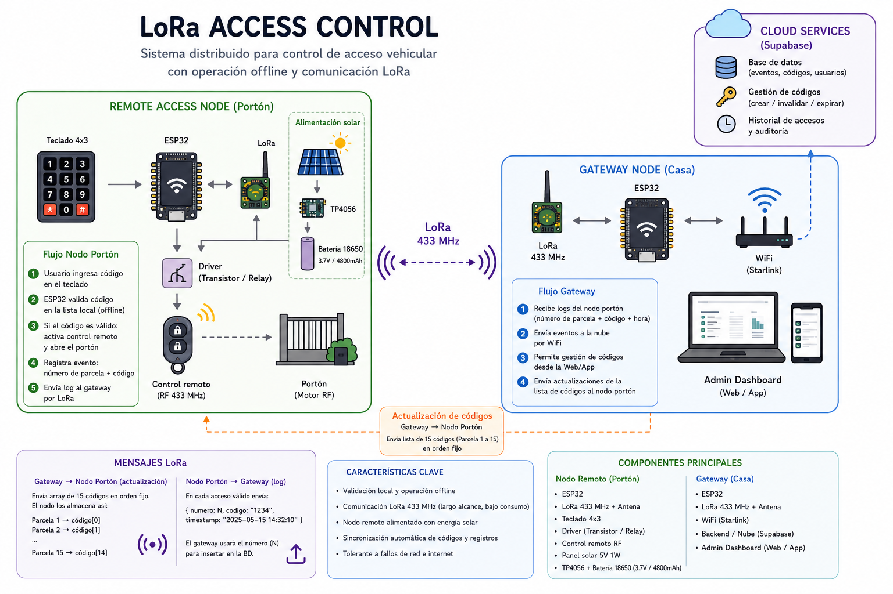
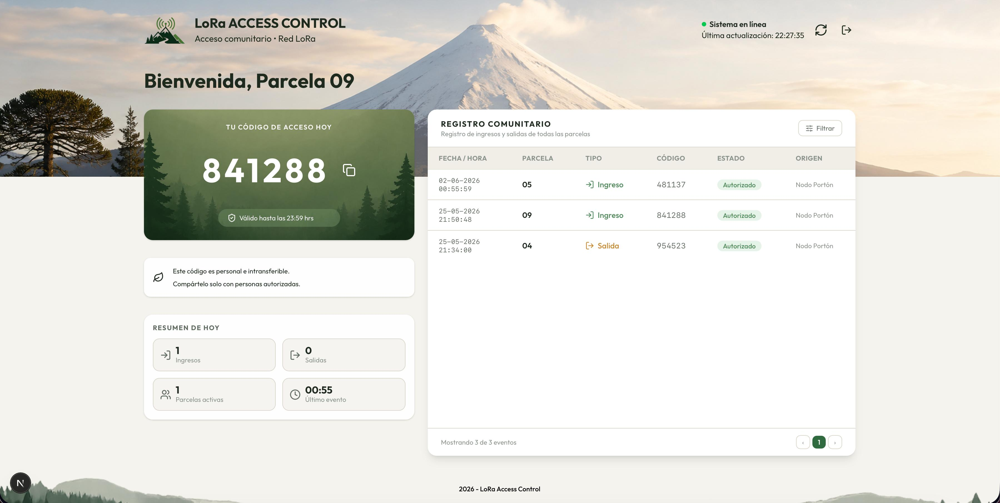

# LoRa Access Control

Sistema distribuido de control de acceso vehicular basado en comunicación LoRa para entornos sin conectividad WiFi o cobertura celular.

El proyecto fue diseñado como una solución para administrar aperturas remotas de portón en parcelas rurales donde el nodo físico no tiene acceso directo a internet.

## Problema

El portón de acceso se encuentra en una ubicación sin WiFi, cobertura celular, conexión cableada.

Sin embargo, era necesario administrar accesos remotamente, validar códigos dinámicos, registrar eventos de apertura, mantener trazabilidad de uso y operar de forma confiable incluso con conectividad limitada.

## Arquitectura

El sistema utiliza una arquitectura distribuida compuesta por:

### Gateway

Nodo conectado a internet mediante Starlink encargado de:

- sincronizar códigos desde Supabase
- transmitir actualizaciones vía LoRa
- recibir logs desde nodos remotos
- persistir eventos de acceso
- actuar como puente cloud ↔ red LoRa

El gateway opera desde una ubicación con conectividad estable y alimentación continua, con posibilidad futura de operación mediante energía solar.

### Nodo remoto

Dispositivo autónomo instalado físicamente en el portón encargado de:

- recibir sincronización de códigos
- validar accesos localmente
- operar offline
- activar apertura mediante optoacoplador
- registrar eventos de uso

El nodo fue diseñado para funcionar en entornos sin conectividad tradicional y alimentarse mediante sistema solar independiente.

## Características principales

- Comunicación LoRa de largo alcance
- Operación offline-first
- Sincronización remota de códigos
- Validación local de acceso
- Registro persistente de eventos
- Dashboard web para visualización
- Integración Supabase
- Arquitectura gateway/nodo
- Activación física mediante relé/optoacoplador

## Flujo de funcionamiento

1. El gateway descarga códigos válidos desde Supabase.
2. Los códigos son transmitidos vía LoRa al nodo remoto.
3. El usuario ingresa un código mediante teclado físico.
4. El nodo valida localmente el acceso.
5. Si el código es válido:
   - activa apertura del portón
   - registra el evento
6. El nodo transmite logs al gateway.
7. El gateway persiste los eventos en Supabase.
8. Los accesos pueden visualizarse desde una interfaz web.

## Stack tecnológico

### Hardware

#### Nodo remoto

- ESP32-C3 SuperMini
- Módulo LoRa E32 433 Hz
- Keypad matricial
- Optoacoplador para activación de portón
- Panel solar 5V 1W
- TP4056 para carga y protección de batería
- Batería 18650 Li-Ion 4800mAh

#### Gateway

- ESP32-C3 SuperMini
- Módulo LoRa E32 433 Hz
- Conectividad WiFi mediante Starlink
- Integración cloud con Supabase

### Backend / Cloud

- Supabase
- PostgreSQL

### Frontend

- Next.js
- TypeScript

### Comunicación

- LoRa
- Serial communication

## Motivación

El proyecto nace de una necesidad real de administrar acceso vehicular compartido en un entorno rural con conectividad limitada.

El sistema debía permitir que propietarios pudieran compartir accesos temporales con terceros —como jardineros, maestros o corredores de propiedades— incluso sin encontrarse físicamente en el lugar.

El principal desafío era que el portón eléctrico se encuentra en una ubicación sin cobertura celular ni conectividad WiFi, por lo que la solución debía operar de forma autónoma y tolerante a fallos de red.

La arquitectura fue diseñada priorizando:

- operación offline-first
- autonomía energética
- bajo consumo
- simplicidad operativa
- sincronización remota

El sistema permite sincronizar códigos de acceso desde internet mediante un gateway conectado vía Starlink, distribuirlos mediante LoRa hacia nodos remotos y validar accesos localmente incluso sin conexión activa.

## Estado actual

Sistema funcional en desarrollo activo. Actualmente se encuentran implementados y operativos:

- comunicación LoRa entre gateway y nodo remoto
- sincronización de códigos mediante Supabase
- validación local desde keypad físico
- flujo completo cloud ↔ gateway ↔ nodo
- registro y transmisión de eventos

Las siguientes etapas consideran:

- integración con control remoto del portón
- implementación de alimentación solar autónoma
- pruebas de autonomía energética
- validación operativa en entorno real

## Arquitectura general

## Dashboard administrativo

